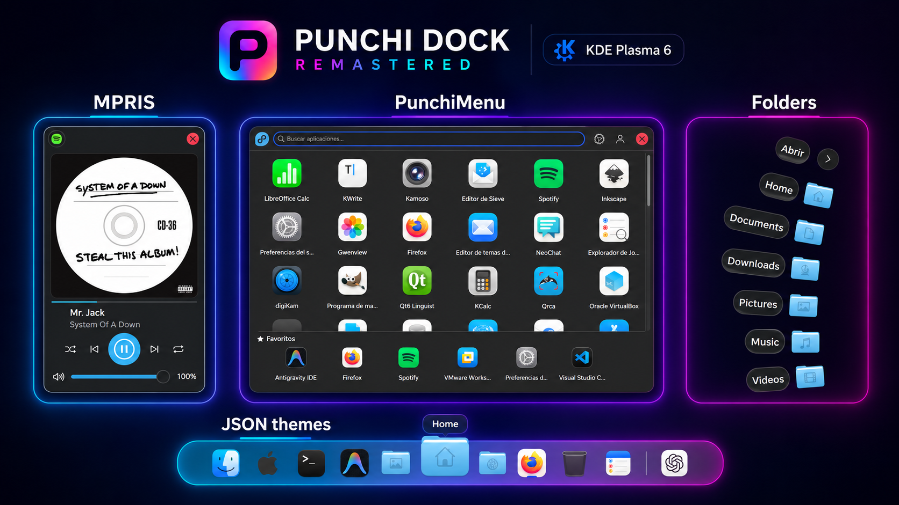
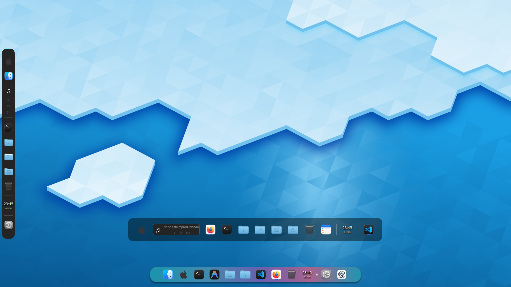
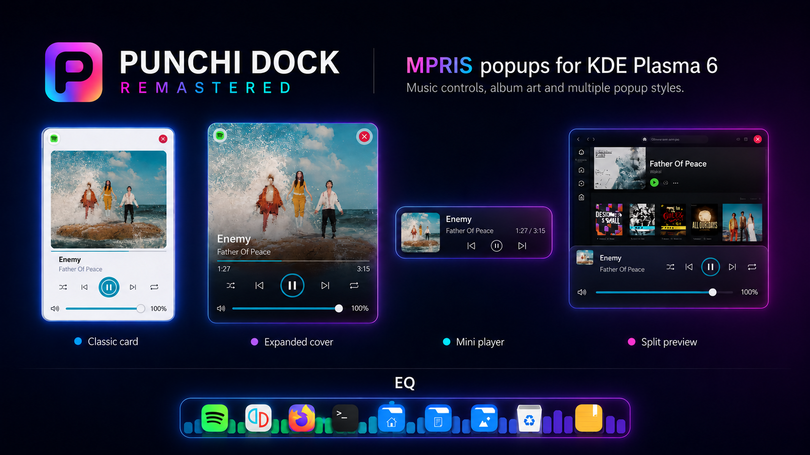
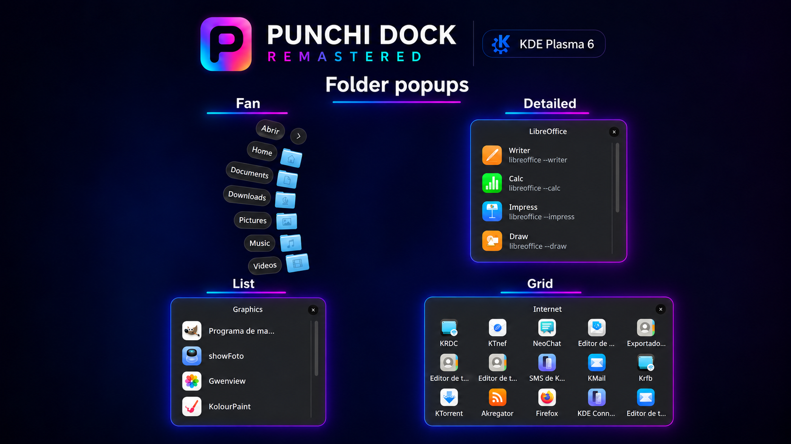
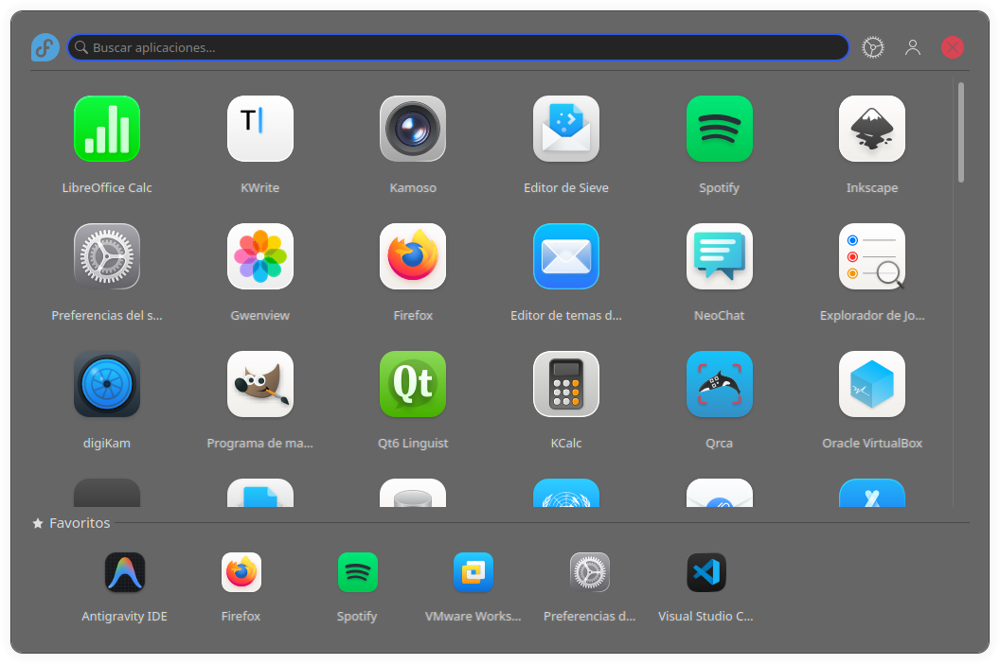
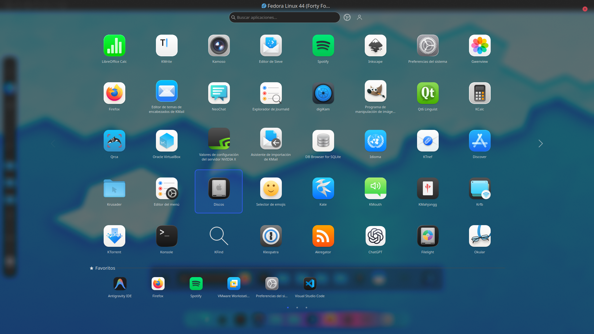
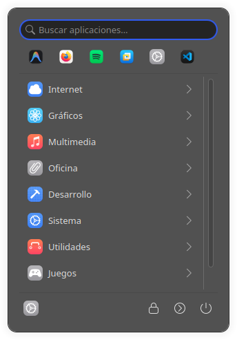
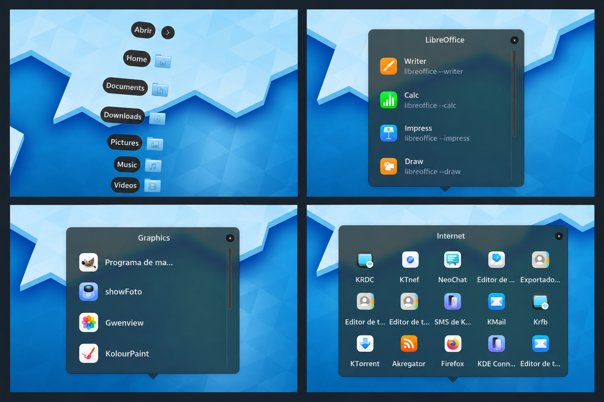

# Punchi Dock Remastered

<p align="center">
  
</p>

<p align="center">
  <a href="https://github.com/PunchiSoft/punchi-dock-remastered/releases/latest"></a>
  <a href="metadata.json"></a>
  <a href="LICENSE"></a>
</p>

[English](README.md) | [Español](README.es.md) | [Deutsch](README.de.md) | [Português (Brasil)](README.pt_BR.md)

Punchi Dock Remastered reúne lanzadores de aplicaciones, ventanas abiertas,
carpetas, controles multimedia y utilidades del escritorio en un dock
personalizable para KDE Plasma 6. Úsalo como dock flotante o dentro de un panel
de Plasma, en horizontal o vertical, con el tema Plasma activo o un fondo personalizado.

Incluye PunchiMenu para buscar y organizar aplicaciones y es una reescritura
modular del [Plasmoide Punchi Dock original](https://github.com/PunchiSoft/punchi-dock-plasmoid).
El proyecto está en desarrollo activo hacia la versión 1.0.

[Funciones](#funciones) · [Capturas](#capturas) · [Instalación](#instalación) · [Compatibilidad](#compatibilidad) · [Pruebas](#pruebas-y-calidad) · [Soporte](#soporte-y-contribuciones)

<p align="center">
  
</p>

<p align="center"><em>Ilustración</em></p>

Este README describe el árbol de código actual. Los paquetes descargables siguen
sus [notas de publicación](https://github.com/PunchiSoft/punchi-dock-remastered/releases);
las funciones marcadas como desarrollo pueden no estar incluidas en la última versión publicada.

## Funciones

### Aplicaciones y ventanas

- **Lanzadores y aplicaciones abiertas:** Ancla aplicaciones, añade lanzadores
  personalizados o comandos de terminal, reordena elementos y muestra una sección
  opcional de aplicaciones abiertas.
- **Controles de ventanas:** Trabaja con ventanas agrupadas, acciones de aplicación,
  indicadores de cantidad de ventanas, filtros por escritorio y tarjetas o miniaturas en vivo.
- **Aplicaciones recientes — desarrollo:** Muestra opcionalmente hasta tres
  aplicaciones recientes como iconos del dock o dentro de un contenedor. Se
  excluyen las aplicaciones ancladas y las que tienen ventanas abiertas. La
  función está desactivada por defecto y utiliza el historial registrado por KDE;
  su disponibilidad depende de las aplicaciones que se reporten.

### Carpetas y colecciones de aplicaciones

- **Cuatro presentaciones:** Elige Cuadrícula, Lista, Detalle o Abanico, con iconos,
  etiquetas, tipografía, escala y animaciones de apertura configurables.
- **Contenido flexible:** Crea colecciones manuales, complétalas desde categorías
  de aplicaciones instaladas o abre elementos de una carpeta del sistema de archivos.
- **Interacción directa:** Arrastra lanzadores desde PunchiMenu o el escritorio,
  cambia la presentación desde el menú contextual y abre la carpeta de origen en Dolphin.

### PunchiMenu

- **Encuentra aplicaciones:** Busca, explora categorías, conserva favoritos,
  organiza carpetas con nombre y oculta aplicaciones seleccionadas.
- **Elige una disposición:** Usa un menú flotante Normal o la presentación en Pantalla completa.
- **Acceso por teclado:** Navega con foco visible, utiliza un atajo global
  configurable y accede a las acciones nativas de sesión de KDE.

### Multimedia y utilidades del escritorio

- **Controles multimedia:** Controla reproductores compatibles con MPRIS mediante
  carátulas, información de pista, acciones de reproducción, selección de
  reproductor y un elemento compacto en el dock.
- **Visualizador de audio (EQ):** Muestra el espectro de la salida de audio del sistema mediante PipeWire detrás de los iconos del dock, en modo flotante y panel de Plasma, horizontal o vertical. Permite elegir seis estilos visuales, colores del tema Plasma o dinámicos, intensidad y dirección de movimiento. Puede mostrarse sobre el fondo de Plasma o sustituirlo por el espectro. Es un efecto visual; no modifica el sonido.
- **Utilidades cotidianas:** Añade papelera, calendario y reloj, notas rápidas y
  separadores. Las operaciones de papelera incluyen progreso y notificaciones de KDE.
- **Centro de control — preliminar:** Accede a superficies de Wi-Fi, Bluetooth,
  audio, brillo, Luz nocturna, notificaciones y acciones frecuentes del sistema.
  Este componente continúa en desarrollo; las preferencias avanzadas utilizan
  los módulos oficiales de KDE.

### Apariencia e interacción

- Soporte para el panel nativo de Plasma con zoom calculado automáticamente.
- **Integración con Plasma:** Adaptación a temas claros y oscuros, con superficies
  de popup temáticas, sombras y desenfoque cuando estén disponibles.
- **Apariencia personalizada:** Elige fondos planos 2D o de repisa 2.5D, temas JSON
  externos, indicadores, etiquetas, espaciado y efectos al pasar el puntero.
- **Configuración inmediata:** Aplica preferencias sin reiniciar Plasma Shell,
  conservando navegación por teclado, nombres accesibles, escalado y movimiento reducido.

### Arrastrar y soltar

- **Dock:** Reordena elementos, ancla lanzadores desde PunchiMenu o el escritorio, añade aplicaciones a contenedores manuales y suelta archivos locales sobre aplicaciones compatibles o la papelera.
- **PunchiMenu:** En los modos Normal y Pantalla completa, reordena aplicaciones y carpetas con orden manual, crea carpetas soltando una aplicación sobre otra, añade aplicaciones a carpetas existentes y arrastra lanzadores al dock o al escritorio.

## Capturas

<p align="center">
  
</p>

### MPRIS

<p align="center">
  
</p>

<p align="center"><em>Ilustración</em></p>

### Popups de carpetas

<p align="center">
  
</p>

<p align="center"><em>Ilustración</em></p>

<details>
<summary>PunchiMenu, controles multimedia y disposiciones del escritorio</summary>

| PunchiMenu Normal | PunchiMenu Pantalla completa — vista preliminar |
|:--:|:--:|
|  |  |

<p align="center">
  
</p>

<p align="center">
  
</p>

Composición ilustrativa de las presentaciones Abanico, Detalle, Lista y Cuadrícula,
basada en capturas del escritorio del 1 de octubre de 2026.

</details>

## Instalación

### Paquete precompilado

Para utilizar un paquete precompilado, elige un archivo para tu sistema en
[GitHub Releases](https://github.com/PunchiSoft/punchi-dock-remastered/releases).
Instálalo o actualízalo desde una copia de este repositorio:

```bash
./scripts-user/setup-universal.sh --no-restart path/to/package.plasmoid
```

También puedes instalarlo con `kpackagetool6 --type Plasma/Applet --install path/to/package.plasmoid`;
utiliza `--upgrade` en lugar de `--install` para actualizar una instalación existente.
### Descargar, compilar e instalar desde el código fuente

1. **Descargar el código fuente**

   ```bash
   git clone https://github.com/PunchiSoft/punchi-dock-remastered.git
   ```

2. **Entrar en la carpeta del proyecto**

   ```bash
   cd punchi-dock-remastered
   ```

3. **Comprobar las dependencias de compilación**

   ```bash
   ./scripts-user/setup.sh --check-deps
   ```

4. **Compilar e instalar**

   ```bash
   ./scripts-user/setup.sh --install --no-restart
   ```

Después añade Punchi Dock Remastered desde la interfaz Añadir elementos gráficos
de Plasma. Si un módulo nativo actualizado sigue cargado, cierra y vuelve a iniciar
sesión para cargar la nueva versión.

### ¿Qué script debo utilizar?

- **Scripts de usuario (`scripts-user/`):** Compilan, empaquetan o instalan el dock para uso cotidiano, sin ejecutar pruebas de desarrollo ni QML lint. Se mantienen las dependencias de compilación y las comprobaciones del paquete.
- **Scripts de desarrollo (`scripts-dev/`):** Validan cambios antes de contribuir o distribuir, mediante QML lint, CTest y comprobaciones de traducciones, integridad de pruebas y empaquetado.

Ejecuta estos comandos desde la raíz del repositorio como tu usuario del escritorio.

| Objetivo | Comando | Qué hace |
|---|---|---|
| Instalar un paquete descargado | `./scripts-user/setup-universal.sh --no-restart path/to/package.plasmoid` | Instala o actualiza el paquete sin reiniciar Plasma; no necesita compilador. |
| Compilar e instalar desde código | `./scripts-user/setup.sh --install --no-restart` | Comprueba dependencias, compila e instala para el sistema actual sin ejecutar pruebas de desarrollo. |
| Crear solamente un paquete | `./scripts-user/setup.sh --build-only --jobs 4` | Crea un paquete local en `dist/` sin instalarlo. |
| Elegir una operación interactivamente | `./scripts-user/setup.sh` | Ofrece compilación, instalación de paquetes, desinstalación, reinicio y opciones de concurrencia. |
| Utilizar el flujo de desarrollo | `./scripts-dev/setup.sh` | Abre el asistente estricto de compilación, validación y empaquetado; preparar dependencias puede requerir sudo. |
| Probar una instalación en Plasma | `./scripts-dev/setup.sh --local-test` | Compila, valida, instala, reinicia Plasma Shell y recoge diagnósticos de arranque. |

Las compilaciones locales se destinan al sistema actual; no son automáticamente
paquetes universales. Las opciones completas y dependencias se documentan en
[scripts de usuario](scripts-user/README.es.md) y [scripts de desarrollo](scripts-dev/README.es.md).

## Compatibilidad

- **Escritorio:** Linux con KDE Plasma 6; Wayland es el objetivo principal y X11
  conserva una vía secundaria.
- **Mínimos declarados de compilación:** CMake 3.22, compilador C++20, Qt 6.6,
  KDE Frameworks 6.0 y Plasma 6.0, además de las bibliotecas de desarrollo requeridas.
- **Compilación nativa:** La compilación de desarrollo está orientada principalmente a Fedora 44 y posteriores y utiliza las bibliotecas Qt y KDE del sistema anfitrión. También existen perfiles para Arch Linux y Debian 13.
- **Paquete universal:** Las compilaciones universales oficiales se realizan en Debian 13. La compatibilidad binaria debe comprobarse con el mismo paquete en cada sistema objetivo.
- **Pruebas de calidad:** El entorno de pruebas observado es Fedora 44, Qt 6.11.2, Plasma 6.7.5, KDE Frameworks 6.30.0, GCC 16.2.1 y CMake 4.3.0. Estos resultados corresponden a ese entorno; las versiones posteriores y otras distribuciones requieren su propia validación.
- **Paquetes nativos:** Utiliza el paquete destinado a tu entorno. Los mínimos
  declarados no certifican todas las combinaciones, y la compatibilidad binaria
  entre distribuciones exige probar el mismo artefacto en cada sistema objetivo.
- **Audio:** El visualizador opcional consume PipeWire; compilar desde código
  requiere sus archivos de desarrollo.
- **Idiomas:** Inglés como fuente y fallback; español mantenido. Alemán y
  portugués brasileño se incluyen como traducciones iniciales pendientes de
  revisión por hablantes nativos. Consulta [la guía de traducciones](po/README.es.md).

## Pruebas y calidad

Punchi Dock combina vistas QML, código nativo C++, configuración persistente y
servicios KDE. Las pruebas ayudan a detectar regresiones como un plasmoide que
no carga, una preferencia que pierde su efecto, actualizaciones incorrectas de
modelos o un paquete al que le faltan archivos antes de que esos cambios lleguen a los usuarios.

| Comprobación | Objetivo |
|---|---|
| CTest | Ejercita lógica nativa, interacción de componentes, carga y destrucción del plasmoide, contratos de configuración e integración con proveedores controlados. |
| Lint QML | Detecta imports, propiedades y bindings sin resolver; el flujo de desarrollo rechaza aumentos sobre el baseline de advertencias del entorno. |
| Traducciones | Comprueba catálogos completos, marcadores de formato y reglas de traducción del proyecto. |
| Integridad de pruebas | Detecta cambios en pruebas protegidas, nombres canónicos y cantidad mínima de la suite. |
| Empaquetado | Verifica el módulo y las traducciones preparados y mantiene los archivos de desarrollo fuera del plasmoide instalado. |

Estas comprobaciones complementan las pruebas manuales en Plasma. Aprobar
pruebas aisladas no demuestra corrección visual, comportamiento del compositor
ni compatibilidad con todas las distribuciones. Los resultados de validación
corresponden a su versión y entorno concretos.

Para una validación reproducible, utiliza las dependencias y el baseline de lint de tu plataforma, recompila con las herramientas actuales y ejecuta las pruebas con configuración y sesiones aisladas. Los artefactos de compilaciones anteriores, los servicios ausentes o un baseline distinto pueden causar fallos. Las pruebas protegidas deben superar el control de integridad; tener cambios pendientes de Git no invalida por sí solo una ejecución.

Para ejecutar CTest sin instalar el plasmoide ni reiniciar Plasma, prepara las
dependencias de compilación y ejecuta:

```bash
cmake -S . -B build -DBUILD_TESTING=ON
cmake --build build --parallel 2
ctest --test-dir build --output-on-failure
```

Esto ejecuta la suite CTest configurada; el flujo completo de mantenimiento
también aplica las comprobaciones independientes de lint, catálogos, integridad
y empaquetado. Consulta [scripts de desarrollo](scripts-dev/README.es.md) e
[integridad de pruebas](scripts-dev/test-integrity/README.md).

## Soporte y contribuciones

Reporta problemas en [GitHub Issues](https://github.com/PunchiSoft/punchi-dock-remastered/issues).
Incluye las versiones de Plasma y Qt, distribución, sesión Wayland o X11,
origen del paquete, pasos de reproducción y comportamiento esperado y observado.
Las capturas y los logs concretos ayudan siempre que no expongan información privada.

Son bienvenidas las contribuciones de código, pruebas reproducibles, mejoras de
documentación y revisiones de traducción. Consulta el [flujo de desarrollo](scripts-dev/README.es.md)
y la [guía de traducciones](po/README.es.md).

<details>
<summary>Estructura del proyecto</summary>

- `contents/`: QML, JavaScript, configuración y recursos del runtime.
- `src/`: integración nativa C++.
- `tests/`: pruebas de comportamiento, runtime, integración y contratos.
- `scripts-user/`: herramientas de compilación e instalación para usuarios.
- `scripts-dev/`: herramientas de validación, empaquetado y mantenimiento.
- `metadata.json`: identidad del paquete y compatibilidad Plasma declarada.

Las notas internas, archivos de desarrollo y herramientas de pruebas quedan fuera del paquete instalado.

</details>

### Desarrollo asistido por IA

Los agentes de IA son un apoyo integral al desarrollo para agilizar la programación, investigar problemas, apoyar refactorizaciones y preparar documentación y pruebas. Sus instrucciones se versionan en [AGENTS.md](AGENTS.md) y [`.agents/`](.agents/). Los mantenedores conservan la responsabilidad de las decisiones técnicas, la revisión y la validación.

Las instrucciones para los agentes y sus skills fueron creadas y configuradas por el autor de Punchi Dock Remastered a partir de investigación propia, lectura de recursos en internet, Wikipedia y debates en Reddit. Estas instrucciones se adaptan a la arquitectura y al flujo de desarrollo del proyecto.

El apoyo económico es opcional: [donaciones mediante PayPal](https://www.paypal.com/donate/?hosted_button_id=HXFSZU4K8C38W).
Nunca es necesario donar para utilizar el proyecto.

## Licencia

Punchi Dock Remastered se distribuye bajo la [Licencia Pública General de GNU versión 3.0 o posterior](LICENSE).

Los avisos de copyright, los términos de licencia y los requisitos de atribución
se aplican tanto al uso humano como al uso asistido por IA. Copiar, modificar,
redistribuir, resumir o generar código basado en este proyecto con ayuda de IA
no elimina ni reemplaza la obligación de cumplir la licencia GPL-3.0-or-later,
conservar los avisos requeridos, proporcionar el código fuente correspondiente
cuando sea obligatorio y atribuir a Punchi Dock Remastered y sus contribuidores
cuando corresponda.

Para el historial de cambios, consulta [CHANGELOG.md](CHANGELOG.md) y
[GitHub Releases](https://github.com/PunchiSoft/punchi-dock-remastered/releases).
