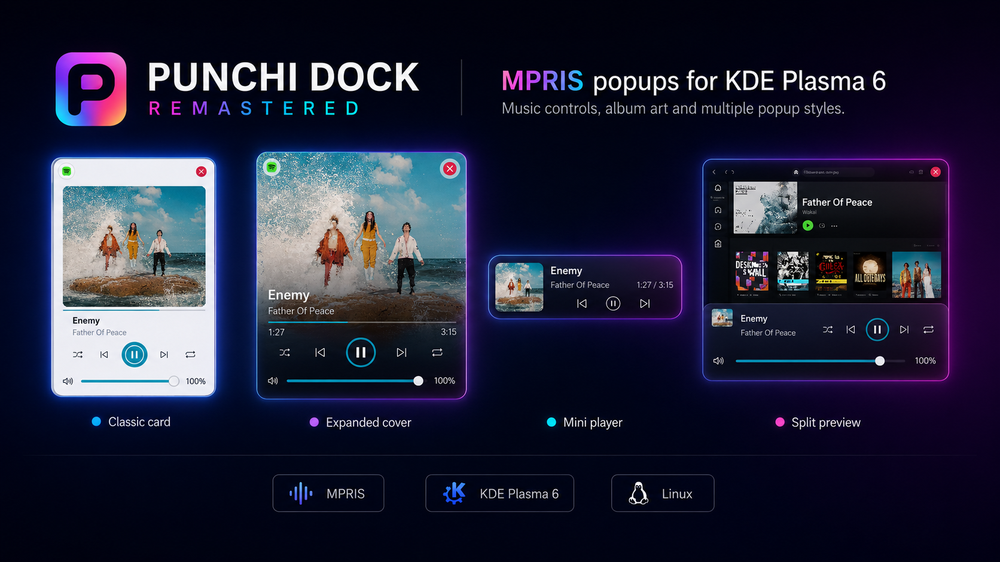
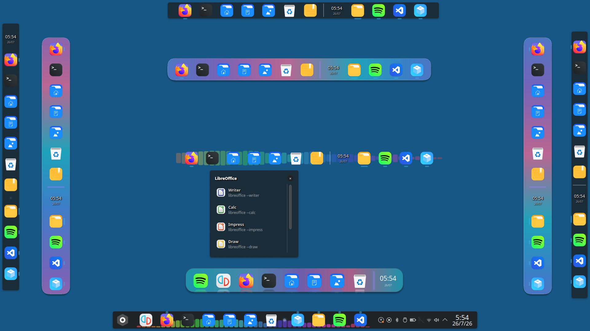
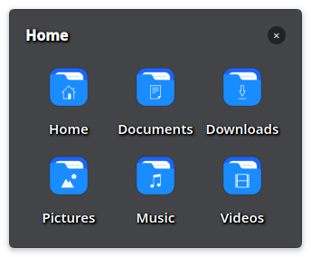
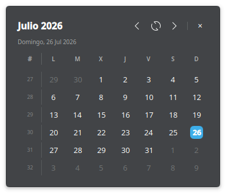

# Punchi Dock Remastered

<p align="center">
  
</p>

<p align="center">
  <a href="https://github.com/PunchiSoft/punchi-dock-remastered/releases/tag/v0.9.7.42">
    
  </a>
  <a href="LICENSE">
    
  </a>
  <a href="https://www.paypal.com/donate/?hosted_button_id=HXFSZU4K8C38W">
    
  </a>
</p>

[English](README.md) | [Español](README.es.md) | [Deutsch](README.de.md) | [Português (Brasil)](README.pt_BR.md)

Punchi Dock Remastered is a native launcher dock and task interface for KDE Plasma 6, designed primarily for Wayland. It can operate as a floating dock or integrate with a Plasma panel while following the active theme.

This repository is a modular rewrite of the original [Punchi Dock Plasmoid](https://github.com/PunchiSoft/punchi-dock-plasmoid). The project is currently preparing its path toward a stable 1.0 release.

The current release is
[v0.9.7.42](https://github.com/PunchiSoft/punchi-dock-remastered/releases/tag/v0.9.7.42).

## What's New in 0.9.7.42

- **Cinematic Menu Spring Reveal & Graceful Close**: Elastic surface spring reveal with dynamic scale (`0.88 ──► 1.00`), anchored slide transitions, and smooth deferred fade out upon closing for both Normal and Compact PunchiMenu modes.
- **100% Validated**: Full CTest suite passed (38/38) and complete translation catalogs.

See the [0.9.7.42 changelog](CHANGELOG.md#09742---2026-08-17) for detailed release
notes and the validation performed for this version.

## Screenshots

| PunchiMenu Normal — recommended preview |
|:--:|
|  |

| PunchiMenu Full Screen |
|:--:|
|  |

| MPRIS media controls |
|:--:|
|  |

| Dock layouts |
|:--:|
|  |

| Folder grid | Calendar and clock |
|:--:|:--:|
|  |  |

## Languages

- English is the runtime source language and fallback.
- Spanish (`es`) is the currently maintained interface translation.
- German (`de`) and Brazilian Portuguese (`pt_BR`) are included as complete
  initial interface-translation drafts. Native-speaker review remains pending
  before they are considered maintained translations.

See [the translation guide](po/README.md) for the catalog policy and
contribution requirements.

## Features

- Floating dock and Plasma panel modes.
- Pinned launchers and optional dynamic task entries.
- Custom launchers with safe preservation of commands and arguments.
- Window cards, live previews, and grouped-window controls, including a choice of cards, live thumbnails, or no preview popup.
- Configurable folders with grid, list, and detail views, direct view switching
  from the context menu, and launcher drag-and-drop from PunchiMenu or the
  desktop, plus quick notes, trash, separators, and calendar items.
- PunchiMenu application launcher with Normal and Fullscreen presentations,
  search, categories, favorites, named application folders, selective hiding,
  keyboard operation, a global shortcut, and native session actions. Compact
  remains reserved for a future version.
- Optional PipeWire audio visualizer with six styles, dynamic or Plasma-themed colors, and up to 48 visual elements.
- Plasma-themed popups with configurable opening animations, adaptive
  theme-aware distance from the dock, smooth preview-to-menu transitions, and
  continuous retargeting between dock items.
- Native application and window actions in the context menus of pinned launchers and dynamic tasks.
- Optional window-count badges for grouped applications with multiple windows.
- Contextual MPRIS media cards with artwork, track information, playback controls, and an accessible mute or restore-volume action in every card layout.
- A compact dock MPRIS item with selectable player, artwork fallback, vertical text modes, and launch-then-Play behavior.
- Circular theme/custom color controls and configurable icon spacing with explicit visual units.
- Persistent dock-item reordering by long press or keyboard, safe file
  drag-and-drop onto pinned applications and the Trash, and item-aware unpin
  actions for applications and folders.
- An optional MPRIS card below live window previews, revealed after the preview to preserve visual continuity.
- Asynchronous trash operations with activity, progress, completion sound, and themed KDE notifications.
- External JSON background themes stored in a managed user library, with recursive folder import, removal, and safe Plasma fallback.
- Flat 2D and shelf-style 2.5D renderers with theme-defined separators, borders, gradients, rims, and bounded glow.
- Theme-adaptive clock and calendar shadows for readability over varying backgrounds.
- Dynamic compatibility with TaskManager APIs exposed by different Plasma 6 versions.
- Portable application window icons and task matching through both application IDs and launcher URLs.
- Stable icon sizing when a Plasma panel switches between always-visible and auto-hide modes.
- Standard XDG user storage compliance: User-imported JSON themes (`~/.local/share/punchi-dock-remastered/`) and instance item configurations (`~/.config/punchi-dock/`) use isolated, atomic-write storage to prevent desktop config corruption and preserve custom data across plasmoid upgrades.
- Native C++ QML integration for application discovery, runtime services, audio analysis, and trash operations.

## Requirements

- KDE Plasma 6 or later.
- Wayland session recommended (secondary X11 support).
- PipeWire is required by the optional audio visualizer.
- **Official Primary Reference Distribution**: Fedora 44 `x86_64` with KDE Plasma 6+.
- **Official Universal Package**: Compiled on Debian 13 (Trixie) with binary C shims (`compat/`), allowing direct installation and execution across multiple modern Linux distributions with Plasma 6 (Fedora, Arch Linux, Debian, Kubuntu, and derivatives).
- **Building Locally from Source**:
  - Requires CMake 3.22+, a C++20 compiler, Qt 6.6+, ECM/KF6 6.0+, Plasma 6.0+, and PipeWire development files (provided by your distribution repositories).
  - Automated assistants are provided with and without tests to build and install in a single step.

## Install a Release Package

End users can directly install an official prebuilt `.plasmoid` package (either distribution-specific or the universal release) without needing compilers or development tools.

To install or update using the universal setup helper:

```bash
./scripts-user/setup-universal.sh path/to/package.plasmoid
```

Or manually using `kpackagetool6`:

```bash
# Initial installation
kpackagetool6 --type Plasma/Applet --install ./punchi-dock-remastered-<version>-<distribution>-x86_64.plasmoid

# Update existing installation
kpackagetool6 --type Plasma/Applet --upgrade ./punchi-dock-remastered-<version>-<distribution>-x86_64.plasmoid
```

Log out and back in, or restart Plasma Shell, if the updated plasmoid is not loaded immediately.

## Build from Source

The plasmoid contains a native C++ module for KDE Plasma 6, PipeWire, and task integration. It can be easily built on any modern Linux distribution with Plasma 6.

### Build Dependencies by Distribution

The `setup.sh` assistant automatically detects and reports any missing packages, but you can also install them manually:

#### Fedora / RHEL / Nobara
```bash
sudo dnf install \
    gcc-c++ cmake extra-cmake-modules \
    qt6-qtbase-devel qt6-qtdeclarative-devel qt6-qtshadertools \
    plasma-workspace-devel pipewire-devel \
    kf6-kconfig-devel kf6-ki18n-devel kf6-kio-devel \
    gettext zip unzip
```

#### Arch Linux / Manjaro / EndeavourOS
```bash
sudo pacman -S --needed \
    base-devel cmake extra-cmake-modules \
    qt6-base qt6-declarative qt6-shadertools \
    plasma-workspace pipewire \
    kconfig ki18n kio kservice
```

#### Debian 13 (Trixie) / Kubuntu / Ubuntu
```bash
sudo apt update && sudo apt install \
    build-essential cmake extra-cmake-modules \
    qt6-base-dev qt6-declarative-dev qt6-shader-baker \
    libplasma-dev libpipewire-0.3-dev \
    libkf6config-dev libkf6i18n-dev libkf6kio-dev \
    gettext zip unzip
```

### Included Build Assistants

The repository provides automated assistants tailored for different needs:

#### 1. User Assistant (Fast & Safe, without tests)

Designed to build and install locally in seconds without running developer test suites:

```bash
./scripts-user/setup.sh
```

- Configures CMake with `BUILD_TESTING=OFF` (skips `qmllint` and CTest).
- Automatically detects your distribution (Fedora, Arch Linux, Debian, Kubuntu, and derivatives) and verifies required packages.
- Features interactive **build concurrency & RAM safety configuration** (Safe Mode with 1 core for virtual machines or <= 4 GB RAM, Balanced Mode, Fast Mode, or Custom parallel jobs).
- Supports direct non-interactive CLI commands:

```bash
# Build and install locally with safe concurrency (1 job for low-memory environments)
./scripts-user/setup.sh --install -j 1

# Create the local .plasmoid package only using 4 parallel jobs
./scripts-user/setup.sh --build-only --jobs 4

# Uninstall the plasmoid from the current desktop
./scripts-user/setup.sh --uninstall
```

The output package is placed in `dist/punchi-dock-remastered-<version>-<distro>-<arch>-local-build.plasmoid`. See [scripts-user/README.md](scripts-user/README.md) for full details.

### 2. Developer Master Assistant (Strict validation with tests)

Designed for developers and contributors who want full codebase validation:

```bash
./scripts-dev/setup.sh
```

- Runs `qmllint` static code checks according to the distribution baseline.
- Configures CMake with `BUILD_TESTING=ON` and runs the complete 67-test CTest suite (architecture contracts, shaders, lifecycle, Plasma integration, and native backend).
- Supports CLI options such as:

```bash
./scripts-dev/setup.sh --local-test           # Build, run all tests, and install to local Plasma
./scripts-dev/setup.sh --local-test -j 1      # Safe mode (1 core) for virtual machines / low RAM
./scripts-dev/setup.sh --local-test --jobs 8 # Fast mode with 8 parallel jobs
./scripts-dev/setup.sh --clean-install         # Clean reinstall from scratch
./scripts-dev/setup.sh --dependencies-only    # Install official distribution build dependencies
./scripts-dev/setup.sh --lang en --help       # Help in English (also supports es, de, pt_BR)
```

See [scripts-dev/README.md](scripts-dev/README.md) for additional developer tools (`check-build-environment.sh`, `update-translations.sh`, `validar-empaquetado-limpio.sh`).

## Project Structure

- `contents/`: runtime plasmoid package.
- `contents/ui/components/`: reusable QML interface components.
- `contents/code/`: shared JavaScript logic and defaults.
- `src/`: native C++ QML integration module.
- `scripts-user/`: normal user build and installation flow.
- `scripts-dev/`: strict testing, packaging, and maintenance tools.
- `metadata.json`: KPackage metadata and Plasma compatibility declaration.

Internal development notes and audit logs are intentionally excluded from the public repository and release package.

## Support the Project

Punchi Dock Remastered is free software. Bug reports, reproducible test results, documentation improvements, translations, and code contributions are all valuable ways to support it.

Financial donations are voluntary and never required to use the project. You can support Punchi Dock Remastered through the [official PayPal donation page](https://www.paypal.com/donate/?hosted_button_id=HXFSZU4K8C38W).

## License

Punchi Dock Remastered is licensed under the [GNU General Public License v3.0 or later](LICENSE).

Copyright notices, license terms, and attribution requirements apply equally to
human and AI-assisted reuse. AI-assisted copying, modification, redistribution,
summarization, or code generation based on this project does not waive or
replace the obligation to comply with the GPL-3.0-or-later license, preserve
required notices, provide corresponding source when required, and attribute
Punchi Dock Remastered and its contributors where applicable.
