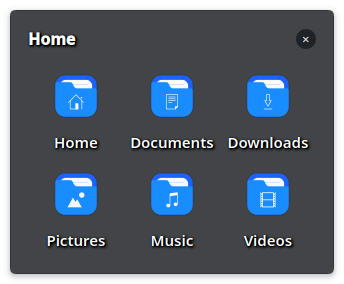
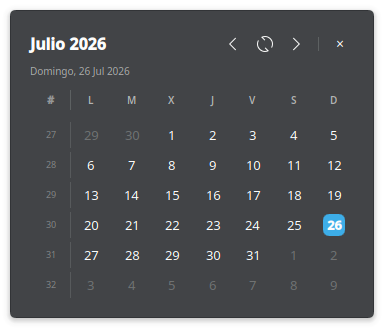

# Punchi Dock Remastered

<p align="center">
  
</p>

<p align="center">
  <a href="https://github.com/PunchiSoft/punchi-dock-remastered/releases/tag/v0.9.7.66">
    
  </a>
  <a href="LICENSE">
    
  </a>
  <a href="https://www.paypal.com/donate/?hosted_button_id=HXFSZU4K8C38W">
    
  </a>
</p>

[English](README.md) | [Español](README.es.md) | [Deutsch](README.de.md) | [Português (Brasil)](README.pt_BR.md)

Punchi Dock Remastered is a native launcher dock and task interface for KDE Plasma 6, designed primarily for Wayland. It can operate as a floating dock or integrate with a Plasma panel while following the active theme.

This repository is a modular rewrite of the original [Punchi Dock Plasmoid](https://github.com/PunchiSoft/punchi-dock-plasmoid). The project is currently preparing its path toward a stable 1.0 release.

The current release is
[v0.9.7.66](https://github.com/PunchiSoft/punchi-dock-remastered/releases/tag/v0.9.7.66).

## Current Development Highlights

These changes are available in the repository after `0.9.7.64`; they are not a
new tagged release yet.

- **Four folder presentations**: Folder containers can use Grid, List,
  Detailed, or the redesigned Fan view. Each presentation has its own global
  icon, row, label, and typography profile. For containers backed by a real
  folder, Grid includes “Open in Dolphin” as its final cell instead of adding a
  separate footer.
- **Better long-name handling**: Folder popup captions stay compact with an
  ellipsis and reveal their complete name with a reversible hover or keyboard
  focus animation. Reduced-motion environments use a stable tooltip instead.
- **More useful first-run layout**: Home starts as a Fan, LibreOffice uses the
  Detailed view, Graphics uses the simple List view, and Internet uses Grid
  with a themed navigation-folder icon. Category-backed containers discover
  the matching installed applications on first use.
- **Larger floating defaults**: A new dock instance starts with 42 px dock
  icons. Folder popup profiles start at 42 px, 150% global scale, and 25% text
  shadows.
- **Automatic folder arrangement**: A folder container set to automatic now
  chooses the grid shape that wastes the least space instead of starting from a
  fixed column count. It prefers the shortest arrangement, keeps a lone element
  off a final line of its own, and only scrolls when the popup height cannot
  hold the rows.
- **Clearer item configuration**: Opening the Items page no longer selects the
  first row implicitly. Pointer and keyboard navigation create an explicit
  selection, contextual notes explain every supported item type, and the page
  shows an orientation note while nothing is selected.
- **Reproducible KConfig auditing**: The maintained configuration auditor checks
  schema entries, KCM ownership, configuration pages, and reactive runtime
  consumers with stable diagnostics and CI-friendly output.
- **Control Center status made explicit**: The Control Center remains a preview
  while its layouts, integrations, and interaction details continue to be
  polished. It is not presented as a finished replacement for System Settings.

## What's New in 0.9.7.64

- **Explanatory Notes for All Item Types**: Added contextual inline notes for all 11 item types in the configuration Items page, covering their behavior, constraints, and formatting guidelines. Notes are fully localized in Spanish, German, and Brazilian Portuguese.

## What's New in 0.9.7.61

- **Native Plasma Panel Integration**: Added direct controls for length, alignment, floating mode, visibility, thickness, and opacity, plus adaptive geometry and input-region synchronization.
- **More Reliable Popups and Window Tasks**: Stabilized grouped-window anchors, folder-popup centering, native popup spacing, per-application row limits, and optional window-count badges.
- **Preliminary Control Center**: Expanded the in-development fullscreen Control Center with Wi-Fi, Bluetooth, sound, display, Night Light, notification, media, and quick-application surfaces. Some controls and placeholders are not yet final.
- **Themes and Audio Spectrum**: Added managed external JSON theme folders with safe removal and unified background replacement for the panel audio spectrum.
- **Smoother Interaction and Media**: Improved category scrolling, interrupted drag cleanup, compact MPRIS morphing, and cross-version Wi-Fi and Bluetooth fallbacks.
- **Cleaner Development Workflow**: Coordinated single-line progress output, safer test concurrency, early sandbox preflight, and automatic cleanup of test caches and temporary files.

See the [0.9.7.61 changelog](CHANGELOG.md#09761---2026-09-15) for detailed release
notes and the validation performed for this version.

## Screenshots

| PunchiMenu Normal — recommended preview |
|:--:|
|  |

| PunchiMenu Full Screen |
|:--:|
|  |

| MPRIS media controls |
|:--:|
|  |

| Dock layouts |
|:--:|
|  |

| Folder grid | Calendar and clock |
|:--:|:--:|
|  |  |

## Languages

- English is the runtime source language and fallback.
- Spanish (`es`) is the currently maintained interface translation.
- German (`de`) and Brazilian Portuguese (`pt_BR`) are included as complete
  initial interface-translation drafts. Native-speaker review remains pending
  before they are considered maintained translations.

See [the translation guide](po/README.md) for the catalog policy and
contribution requirements.

## Capabilities

### Dock, launchers, and running applications

- Runs as a standalone floating dock or as part of a Plasma panel, in horizontal
  or vertical orientation, with panel-aware sizing and input regions.
- Combines pinned applications with an optional dynamic running-applications
  section. Tasks support grouped windows, native application/window actions,
  window-count badges, minimize effects, and current-desktop filtering.
- Shows configurable window cards, live thumbnails, or no preview popup. An
  optional MPRIS card can appear below a live window preview without replacing
  the window controls.
- Supports custom launchers while preserving commands and arguments, persistent
  reordering by long press or keyboard, item-aware unpin actions, and safe file
  drops onto applications and the Trash.
- Matches tasks through application IDs and launcher URLs and adapts to the
  TaskManager roles exposed by different Plasma 6 versions.

### Dock items and folder containers

- Supports applications, PunchiMenu, Konsole commands, folders, dynamic
  applications, Control Center, Trash, calendar/clock, quick notes, media, and
  visual separators. The Items page explains the behavior and limitations of
  each type.
- Folder containers offer Grid, List, Detailed, and Fan presentations. Profiles
  control icon size, visible rows, labels, fonts, scale, opacity, blur, opening
  motion, and text shadows globally for each presentation.
- Containers can be filled manually or seeded from installed application
  categories. They support direct layout switching and launcher drag-and-drop
  from PunchiMenu or the desktop. A Grid backed by a filesystem location places
  its file-manager action directly after the visible items; List, Detailed, and
  Fan preserve presentation-specific action rows.
- Long application names are elided without changing popup geometry and reveal
  their full value on hover or keyboard focus. Accessible names always retain
  the complete text.
- The Fan presentation follows the dock edge, supports keyboard and pointer
  operation, can optionally scroll, and offers a final action for opening the
  backing folder when entries do not fit.

### PunchiMenu application launcher

- Normal and Fullscreen presentations with application search, categories,
  favorites, named application folders, selective hiding, and native session
  actions. Compact remains reserved for a future version.
- Full keyboard navigation, visible focus, a configurable global shortcut, and
  shared interaction states for pointer, focus, press, selection, and drag
  targets.
- Application-folder overlays preserve focus, outside-click dismissal, wheel
  blocking, Escape handling, and theme-derived modal surfaces.

### Popups, media, and desktop utilities

- Plasma-themed folder, task, media, Trash, calendar, note, and action popups
  with adaptive placement, configurable opening animations, theme-aware gaps,
  blur where supported, and continuous retargeting between dock items.
- Contextual MPRIS cards provide artwork, track metadata, playback controls,
  player selection, artwork fallback, and accessible mute/restore-volume
  actions. A compact dock media item supports horizontal and vertical layouts.
- Trash operations run asynchronously with progress, activity feedback,
  completion sound, and themed KDE notifications.
- Calendar and clock surfaces use theme-adaptive text shadows, while notes keep
  their own stored content and popup workflow.
- An optional PipeWire audio spectrum offers six visual styles, dynamic or
  Plasma-theme colors, configurable direction and intensity, and up to 48
  visual elements.

### Appearance and configuration

- Uses Plasma theme colors and surfaces by default, including light/dark theme
  adaptation, themed separators, borders, shadows, blur regions, and popup
  backgrounds.
- Includes flat 2D and shelf-style 2.5D dock renderers with gradients, rims,
  reflections, bounded glow, indicators, labels, spacing, and hover motion.
- Supports external JSON background themes in a managed user library, including
  recursive import, safe removal, validation, and automatic Plasma fallback.
- Configuration changes apply reactively without restarting `plasmashell`.
  Apply, Cancel, defaults, per-profile controls, and persisted item data use the
  Plasma KConfig/KCM contract.
- Stores imported themes under
  `~/.local/share/punchi-dock-remastered/` and instance item data under
  `~/.config/punchi-dock/` using isolated, atomic-write storage.

### Preliminary Control Center

The Control Center is an in-development preview, not a finished replacement for
KDE System Settings. It currently explores fullscreen and floating surfaces for
Wi-Fi, Bluetooth, audio volume, display brightness, Do Not Disturb, Light/Dark
theme switching, Night Light temperature, media, quick applications, and
notification history. Some controls, integrations, placeholders, and layouts
are still being refined and may change before the 1.0 release.

### Native integration, accessibility, and reliability

- Native C++ QML integration handles application discovery, task and window
  services, category classification, audio analysis, Trash operations, theme
  validation, popup blur, panel geometry, and input-region synchronization.
- Designed primarily for Wayland with secondary X11 support, while preserving
  keyboard navigation, accessible names and roles, visible focus, theme
  contrast, display scaling, and reduced-motion behavior.
- Development gates include full applet loading and teardown, component QML
  runtime tests, native integration tests, translation validation, strict
  `qmllint` baselines, package checks, temporary-environment cleanup, and a
  reproducible KConfig/KCM connectivity auditor.

## Requirements

- KDE Plasma 6 or later.
- Wayland session recommended (secondary X11 support).
- PipeWire is required by the optional audio visualizer.
- **Official Primary Reference Distribution**: Fedora 44 `x86_64` with KDE Plasma 6+.
- **Official Universal Package**: Compiled on Debian 13 (Trixie) with binary C shims (`compat/`), allowing direct installation and execution across multiple modern Linux distributions with Plasma 6 (Fedora, Arch Linux, Debian, Kubuntu, and derivatives).
- **Building Locally from Source**:
  - Requires CMake 3.22+, a C++20 compiler, Qt 6.6+, ECM/KF6 6.0+, Plasma 6.0+, and PipeWire development files (provided by your distribution repositories).
  - Automated assistants are provided with and without tests to build and install in a single step.

## Install a Release Package

End users can directly install an official prebuilt `.plasmoid` package (either distribution-specific or the universal release) without needing compilers or development tools.

To install or update using the universal setup helper:

```bash
./scripts-user/setup-universal.sh path/to/package.plasmoid
```

Or manually using `kpackagetool6`:

```bash
# Initial installation
kpackagetool6 --type Plasma/Applet --install ./punchi-dock-remastered-<version>-<distribution>-x86_64.plasmoid

# Update existing installation
kpackagetool6 --type Plasma/Applet --upgrade ./punchi-dock-remastered-<version>-<distribution>-x86_64.plasmoid
```

Log out and back in, or restart Plasma Shell, if the updated plasmoid is not loaded immediately.

## Build from Source

The plasmoid contains a native C++ module for KDE Plasma 6, PipeWire, and task integration. It can be easily built on any modern Linux distribution with Plasma 6.

### Build Dependencies by Distribution

The `setup.sh` assistant automatically detects and reports any missing packages, but you can also install them manually:

#### Fedora / RHEL / Nobara
```bash
sudo dnf install \
    gcc-c++ cmake extra-cmake-modules \
    qt6-qtbase-devel qt6-qtdeclarative-devel qt6-qtshadertools \
    plasma-workspace-devel pipewire-devel \
    kf6-kconfig-devel kf6-ki18n-devel kf6-kio-devel \
    gettext zip unzip
```

#### Arch Linux / Manjaro / EndeavourOS
```bash
sudo pacman -S --needed \
    base-devel cmake extra-cmake-modules \
    qt6-base qt6-declarative qt6-shadertools \
    plasma-workspace pipewire \
    kconfig ki18n kio kservice
```

#### Debian 13 (Trixie) / Kubuntu / Ubuntu
```bash
sudo apt update && sudo apt install \
    build-essential cmake extra-cmake-modules \
    qt6-base-dev qt6-declarative-dev qt6-shader-baker \
    libplasma-dev libpipewire-0.3-dev \
    libkf6config-dev libkf6i18n-dev libkf6kio-dev \
    gettext zip unzip
```

### Included Build Assistants

The repository provides automated assistants tailored for different needs:

#### 1. User Assistant (Fast & Safe, without tests)

Designed to build and install locally in seconds without running developer test suites:

```bash
./scripts-user/setup.sh
```

- Configures CMake with `BUILD_TESTING=OFF` (skips `qmllint` and CTest).
- Automatically detects your distribution (Fedora, Arch Linux, Debian, Kubuntu, and derivatives) and verifies required packages.
- Features interactive **build concurrency & RAM safety configuration** (Safe Mode with 1 core for virtual machines or <= 4 GB RAM, Balanced Mode, Fast Mode, or Custom parallel jobs).
- Supports direct non-interactive CLI commands:

```bash
# Build and install locally with safe concurrency (1 job for low-memory environments)
./scripts-user/setup.sh --install -j 1

# Create the local .plasmoid package only using 4 parallel jobs
./scripts-user/setup.sh --build-only --jobs 4

# Uninstall the plasmoid from the current desktop
./scripts-user/setup.sh --uninstall
```

The output package is placed in `dist/punchi-dock-remastered-<version>-<distro>-<arch>-local-build.plasmoid`. See [scripts-user/README.md](scripts-user/README.md) for full details.

### 2. Developer Master Assistant (Strict validation with tests)

Designed for developers and contributors who want full codebase validation:

```bash
./scripts-dev/setup.sh
```

- Runs `qmllint` static code checks according to the distribution baseline.
- Configures CMake with `BUILD_TESTING=ON` and runs the complete 133-test CTest suite (architecture contracts, QML runtime, lifecycle, Plasma integration, configuration auditing, and native backend).
- Supports CLI options such as:

```bash
./scripts-dev/setup.sh --local-test           # Build, run all tests, and install to local Plasma
./scripts-dev/setup.sh --local-test -j 1      # Safe mode (1 core) for virtual machines / low RAM
./scripts-dev/setup.sh --local-test --jobs 8 # Fast mode with 8 parallel jobs
./scripts-dev/setup.sh --clean-install         # Clean reinstall from scratch
./scripts-dev/setup.sh --dependencies-only    # Install official distribution build dependencies
./scripts-dev/setup.sh --lang en --help       # Help in English (also supports es, de, pt_BR)
```

See [scripts-dev/README.md](scripts-dev/README.md) for additional developer tools (`check-build-environment.sh`, `update-translations.sh`, `validar-empaquetado-limpio.sh`).

## Project Structure

- `contents/`: runtime plasmoid package.
- `contents/ui/components/`: reusable QML interface components.
- `contents/code/`: shared JavaScript logic and defaults.
- `src/`: native C++ QML integration module.
- `scripts-user/`: normal user build and installation flow.
- `scripts-dev/`: strict testing, packaging, and maintenance tools.
- `.agents/`: versioned AI-agent policies, specialized skills, and inventory.
- `AGENTS.md`: canonical project instructions for development agents.
- `metadata.json`: KPackage metadata and Plasma compatibility declaration.

Internal development notes and audit logs are intentionally excluded from the public repository and release package.

## AI-assisted development

Punchi Dock Remastered includes versioned infrastructure for using artificial
intelligence agents during development, review, testing, and documentation.
This adapts the project workflow to current AI-assisted development tools while
keeping architecture, compatibility, validation, and change scope explicit.

The agent instructions live in [AGENTS.md](AGENTS.md) and
[`.agents/`](.agents/). They include the general project policy and specialized
skills for areas such as KDE Plasma, QML, testing, packaging, security,
localization, and code review. Versioning these files makes changes to agent
instructions reproducible and auditable like any other project change.

Agents support development; project tests, validation, and review remain the
sources of verification for the result.

## Support the Project

Punchi Dock Remastered is free software. Bug reports, reproducible test results, documentation improvements, translations, and code contributions are all valuable ways to support it.

Financial donations are voluntary and never required to use the project. You can support Punchi Dock Remastered through the [official PayPal donation page](https://www.paypal.com/donate/?hosted_button_id=HXFSZU4K8C38W).

## License

Punchi Dock Remastered is licensed under the [GNU General Public License v3.0 or later](LICENSE).

Copyright notices, license terms, and attribution requirements apply equally to
human and AI-assisted reuse. AI-assisted copying, modification, redistribution,
summarization, or code generation based on this project does not waive or
replace the obligation to comply with the GPL-3.0-or-later license, preserve
required notices, provide corresponding source when required, and attribute
Punchi Dock Remastered and its contributors where applicable.
