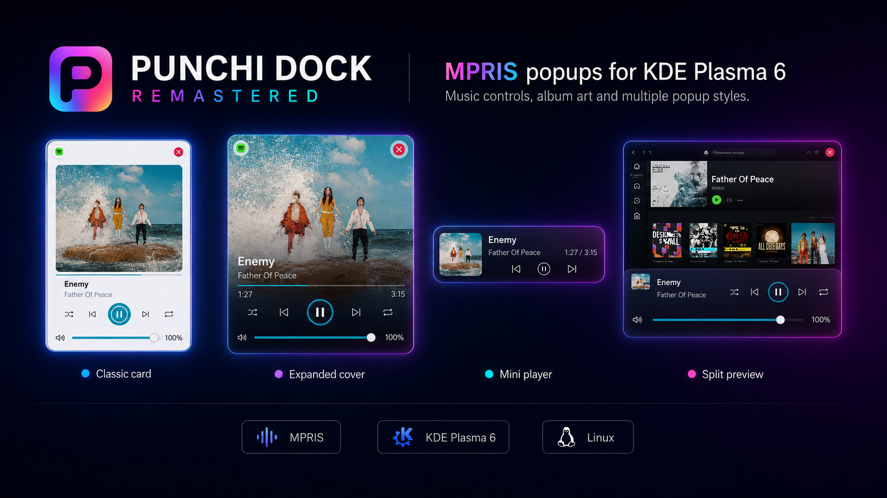
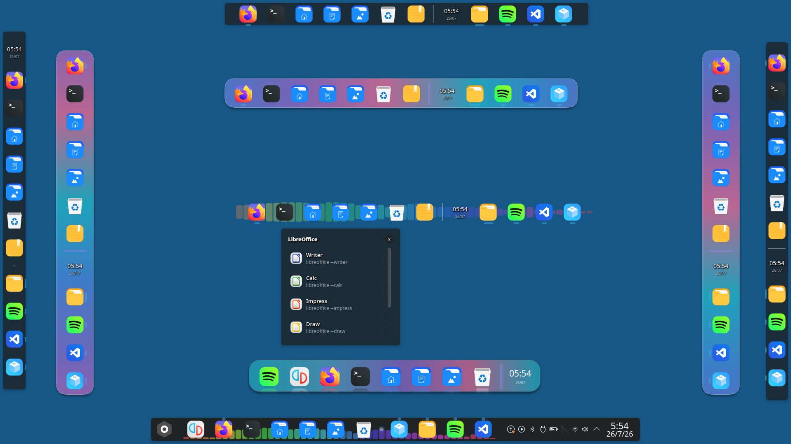

# Punchi Dock Remastered

<p align="center">
  
</p>

<p align="center">
  <a href="https://github.com/PunchiSoft/punchi-dock-remastered/releases/latest"></a>
  <a href="metadata.json"></a>
  <a href="LICENSE"></a>
</p>

[English](README.md) | [Español](README.es.md) | [Deutsch](README.de.md) | [Português (Brasil)](README.pt_BR.md)

O Punchi Dock Remastered reúne lançadores de aplicativos, janelas abertas,
pastas, controles de mídia e utilitários do desktop em uma dock personalizável
para KDE Plasma 6. Use como dock flutuante ou dentro de um painel do Plasma,
na horizontal ou vertical, com o tema Plasma ativo ou um fundo personalizado.

Inclui o PunchiMenu para encontrar e organizar aplicativos e é uma reescrita
modular do [Punchi Dock Plasmoid original](https://github.com/PunchiSoft/punchi-dock-plasmoid).
O projeto está em desenvolvimento ativo rumo à versão 1.0.

[Recursos](#recursos) · [Capturas](#capturas-de-tela) · [Instalação](#instalação) · [Compatibilidade](#compatibilidade) · [Testes](#testes-e-qualidade) · [Suporte](#suporte-e-contribuições)

<p align="center">
  
</p>

<p align="center"><em>Ilustração</em></p>

Este README descreve a árvore de código atual. Os pacotes disponíveis para
download seguem suas [notas de versão](https://github.com/PunchiSoft/punchi-dock-remastered/releases);
recursos marcados como em desenvolvimento podem não estar incluídos na versão publicada mais recente.

## Recursos

### Aplicativos e janelas

- **Lançadores e aplicativos abertos:** Fixe aplicativos, adicione lançadores
  personalizados ou comandos de terminal, reordene itens e exiba uma seção
  opcional de aplicativos abertos.
- **Controles de janelas:** Trabalhe com janelas agrupadas, ações de aplicativos,
  indicadores de quantidade de janelas, filtros por área de trabalho e cartões
  configuráveis ou miniaturas de janelas ao vivo.
- **Aplicativos recentes — em desenvolvimento:** Exiba opcionalmente até três
  aplicativos recentes como ícones na dock ou em um contêiner. Aplicativos
  fixados e aqueles com janelas abertas são excluídos. O recurso vem desativado
  por padrão e usa o histórico registrado pelo KDE; a disponibilidade depende
  dos aplicativos reportados.

### Pastas e coleções de aplicativos

- **Quatro apresentações:** Escolha Grade, Lista, Detalhada ou Leque, com ícones,
  rótulos, tipografia, escala e animações de abertura configuráveis.
- **Conteúdo flexível:** Crie coleções manuais, preencha com categorias de
  aplicativos instalados ou abra itens de uma pasta do sistema de arquivos.
- **Interação direta:** Arraste lançadores do PunchiMenu ou do desktop, altere
  a apresentação pelo menu de contexto e abra a pasta de origem no Dolphin.

### PunchiMenu

- **Encontre aplicativos:** Pesquise, navegue por categorias, mantenha favoritos,
  organize pastas com nomes e oculte aplicativos selecionados.
- **Escolha uma disposição:** Use um menu flutuante Normal ou a apresentação em Tela cheia.
- **Acesso por teclado:** Navegue com foco visível, use um atalho global
  configurável e acesse as ações nativas de sessão do KDE.

### Mídia e utilitários do desktop

- **Controles de mídia:** Controle reprodutores compatíveis com MPRIS com capas,
  informações de faixa, ações de reprodução, seleção de reprodutor e um item compacto na dock.
- **Visualização de áudio:** Ative um espectro PipeWire com seis estilos visuais
  e cores, direção e intensidade configuráveis.
- **Utilitários cotidianos:** Adicione lixeira, calendário e relógio, notas rápidas
  e separadores. As operações da lixeira incluem progresso e notificações do KDE.
- **Central de controle — preliminar:** Acesse interfaces para Wi-Fi, Bluetooth,
  áudio, brilho, Luz noturna, notificações e ações frequentes do sistema. Este
  componente continua em desenvolvimento; as configurações avançadas usam
  os módulos oficiais do KDE.

### Aparência e interação

- Suporte ao painel nativo do Plasma com zoom calculado automaticamente.
- **Integração com o Plasma:** Adaptação a temas claros e escuros, com superfícies
  temáticas de popup, sombras e desfoque quando disponíveis.
- **Aparência personalizada:** Escolha fundos planos 2D ou de prateleira 2.5D,
  temas JSON externos, indicadores, rótulos, espaçamento e efeitos ao passar o ponteiro.
- **Configuração imediata:** Aplique preferências sem reiniciar o Plasma Shell,
  preservando navegação por teclado, nomes acessíveis, escala e movimento reduzido.

### Arrastar e soltar

- **Dock:** Reordene elementos, fixe lançadores do PunchiMenu ou da área de trabalho, adicione aplicativos a contêineres manuais e solte arquivos locais sobre aplicativos compatíveis ou a lixeira.
- **PunchiMenu:** Nos modos Normal e Tela cheia, reordene aplicativos e pastas com ordenação manual, crie pastas soltando um aplicativo sobre outro, adicione aplicativos a pastas existentes e arraste lançadores para o dock ou a área de trabalho.

## Capturas de tela

<p align="center">
  
</p>

<p align="center">
  
</p>

Composição ilustrativa das apresentações Leque, Detalhada, Lista e Grade,
baseada em capturas do desktop de 1 de outubro de 2026.

<details>
<summary>PunchiMenu, controles de mídia e disposições do desktop</summary>

| PunchiMenu Normal | PunchiMenu Tela cheia — prévia inicial |
|:--:|:--:|
|  |  |

<p align="center">
  
</p>





</details>

## Instalação

### Pacote pré-compilado

Para usar um pacote pré-compilado, escolha um arquivo para seu sistema no
[GitHub Releases](https://github.com/PunchiSoft/punchi-dock-remastered/releases).
Instale ou atualize a partir de uma cópia deste repositório:

```bash
./scripts-user/setup-universal.sh --no-restart path/to/package.plasmoid
```

Você também pode instalar com `kpackagetool6 --type Plasma/Applet --install path/to/package.plasmoid`;
use `--upgrade` em vez de `--install` para atualizar uma instalação existente.
### Baixar, compilar e instalar a partir do código-fonte

1. **Baixar o código-fonte**

   ```bash
   git clone https://github.com/PunchiSoft/punchi-dock-remastered.git
   ```

2. **Entrar na pasta do projeto**

   ```bash
   cd punchi-dock-remastered
   ```

3. **Verificar as dependências de compilação**

   ```bash
   ./scripts-user/setup.sh --check-deps
   ```

4. **Compilar e instalar**

   ```bash
   ./scripts-user/setup.sh --install --no-restart
   ```

Depois adicione o Punchi Dock Remastered pela interface de adicionar widgets do
Plasma. Se um módulo nativo atualizado continuar carregado, encerre e inicie
a sessão novamente para carregar a nova versão.

### Qual script devo usar?

Execute estes comandos na raiz do repositório como seu usuário do desktop.

| Objetivo | Comando | O que faz |
|---|---|---|
| Instalar um pacote baixado | `./scripts-user/setup-universal.sh --no-restart path/to/package.plasmoid` | Instala ou atualiza o pacote sem reiniciar o Plasma; não precisa de compilador. |
| Compilar e instalar a partir do código | `./scripts-user/setup.sh --install --no-restart` | Verifica dependências, compila e instala para o sistema atual sem executar testes de desenvolvimento. |
| Criar somente um pacote | `./scripts-user/setup.sh --build-only --jobs 4` | Cria um pacote local em `dist/` sem instalá-lo. |
| Escolher uma operação interativamente | `./scripts-user/setup.sh` | Oferece compilação, instalação de pacotes, desinstalação, reinício e opções de paralelismo. |
| Usar o fluxo de desenvolvimento | `./scripts-dev/setup.sh` | Abre o assistente rigoroso de compilação, validação e empacotamento; preparar dependências pode exigir sudo. |
| Testar uma instalação no Plasma | `./scripts-dev/setup.sh --local-test` | Compila, valida, instala, reinicia o Plasma Shell e coleta diagnósticos de inicialização. |

Compilações locais são destinadas ao sistema atual; não são automaticamente
pacotes universais. As opções completas e dependências estão documentadas em
[scripts de usuário](scripts-user/README.md) e [scripts de desenvolvimento](scripts-dev/README.md).

## Compatibilidade

- **Desktop:** Linux com KDE Plasma 6; Wayland é o alvo principal, com uma via secundária para X11.
- **Mínimos declarados de compilação:** CMake 3.22, compilador C++20, Qt 6.6,
  KDE Frameworks 6.0 e Plasma 6.0, além das bibliotecas de desenvolvimento necessárias.
- **Compilação nativa:** As compilações de desenvolvimento são voltadas principalmente ao Fedora 44 e posteriores e usam as bibliotecas Qt e KDE do sistema anfitrião. Também há perfis para Arch Linux e Debian 13.
- **Pacote universal:** As compilações universais oficiais são feitas no Debian 13. A compatibilidade binária deve ser verificada com o mesmo pacote em cada sistema de destino.
- **Testes de qualidade:** O ambiente de testes observado é Fedora 44, Qt 6.11.2, Plasma 6.7.5, KDE Frameworks 6.30.0, GCC 16.2.1 e CMake 4.3.0. Esses resultados correspondem a esse ambiente; versões posteriores e outras distribuições exigem sua própria validação.
- **Pacotes nativos:** Use o pacote destinado ao seu ambiente. Os mínimos
  declarados não certificam todas as combinações, e a compatibilidade binária
  entre distribuições exige testar o mesmo artefato em cada sistema de destino.
- **Áudio:** O visualizador opcional consome PipeWire; compilar a partir do código
  requer seus arquivos de desenvolvimento.
- **Idiomas:** Inglês é o idioma fonte e fallback; espanhol é mantido. Alemão e
  português brasileiro são incluídos como traduções iniciais aguardando revisão
  por falantes nativos. Veja [o guia de traduções](po/README.md).

## Testes e qualidade

O Punchi Dock combina interfaces QML, código nativo C++, configuração persistente
e serviços KDE. Os testes ajudam a detectar regressões como um plasmoide que não
carrega, uma preferência que perde seu efeito, atualizações incorretas de modelos
ou um pacote com arquivos ausentes antes que essas mudanças cheguem aos usuários.

| Verificação | Objetivo |
|---|---|
| CTest | Exercita lógica nativa, interação de componentes, carregamento e destruição do plasmoide, contratos de configuração e integração com provedores controlados. |
| Lint QML | Detecta imports, propriedades e bindings não resolvidos; o fluxo de desenvolvimento rejeita aumentos em relação ao baseline de avisos do ambiente. |
| Traduções | Verifica catálogos completos, marcadores de formato e regras de tradução do projeto. |
| Integridade dos testes | Detecta alterações em testes protegidos, nomes canônicos e quantidade mínima da suíte. |
| Empacotamento | Verifica o módulo e as traduções preparados e mantém arquivos de desenvolvimento fora do plasmoide instalado. |

Essas verificações complementam os testes manuais no Plasma. Aprovar testes
isolados não comprova correção visual, comportamento do compositor ou
compatibilidade com todas as distribuições. Os resultados de validação
correspondem à sua versão e ambiente específicos.

Para executar CTest sem instalar o plasmoide nem reiniciar o Plasma, prepare
as dependências de compilação e execute:

```bash
cmake -S . -B build -DBUILD_TESTING=ON
cmake --build build --parallel 2
ctest --test-dir build --output-on-failure
```

Isso executa a suíte CTest configurada; o fluxo completo de manutenção também
aplica as verificações independentes de lint, catálogos, integridade e
empacotamento. Veja [scripts de desenvolvimento](scripts-dev/README.md) e
[integridade dos testes](scripts-dev/test-integrity/README.md).

## Suporte e contribuições

Relate problemas no [GitHub Issues](https://github.com/PunchiSoft/punchi-dock-remastered/issues).
Inclua as versões do Plasma e Qt, distribuição, sessão Wayland ou X11, origem
do pacote, passos para reproduzir e comportamento esperado e observado.
Capturas e logs específicos ajudam quando não expõem informações privadas.

Contribuições de código, testes reproduzíveis, melhorias na documentação e
revisões de tradução são bem-vindos. Consulte o [fluxo de desenvolvimento](scripts-dev/README.md)
e o [guia de traduções](po/README.md).

<details>
<summary>Estrutura do projeto</summary>

- `contents/`: QML, JavaScript, configuração e recursos do runtime.
- `src/`: integração nativa C++.
- `tests/`: testes de comportamento, runtime, integração e contratos.
- `scripts-user/`: ferramentas de compilação e instalação para usuários.
- `scripts-dev/`: ferramentas de validação, empacotamento e manutenção.
- `metadata.json`: identidade do pacote e compatibilidade Plasma declarada.

Notas internas, arquivos de desenvolvimento e ferramentas de testes ficam fora do pacote instalado.

</details>

### Desenvolvimento assistido por IA

Os agentes de IA são um apoio integral ao desenvolvimento para agilizar a programação, investigar problemas, apoiar refatorações e preparar documentação e testes. Suas instruções são versionadas em [AGENTS.md](AGENTS.md) e [`.agents/`](.agents/). Os mantenedores continuam responsáveis pelas decisões técnicas, pela revisão e pela validação.

O apoio financeiro é opcional: [doações pelo PayPal](https://www.paypal.com/donate/?hosted_button_id=HXFSZU4K8C38W).
Doações nunca são necessárias para usar o projeto.

## Licença

Punchi Dock Remastered é licenciado sob a [GNU General Public License v3.0 ou posterior](LICENSE).

Avisos de direitos autorais, termos de licença e requisitos de atribuição se
aplicam igualmente ao uso humano e ao uso assistido por IA. Copiar, modificar,
redistribuir, resumir ou gerar código baseado neste projeto com ajuda de IA não
dispensa nem substitui a obrigação de cumprir a GPL-3.0-or-later, preservar os
avisos exigidos, fornecer o código-fonte correspondente quando necessário e
atribuir o Punchi Dock Remastered e seus colaboradores quando aplicável.

Para o histórico de alterações, veja [CHANGELOG.md](CHANGELOG.md) e
[GitHub Releases](https://github.com/PunchiSoft/punchi-dock-remastered/releases).
